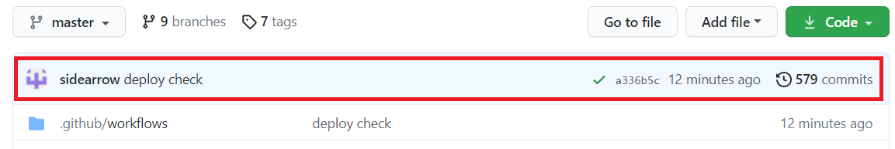

# MANUAL

## 作業前に確認しておくこと

- 自分の環境を最新にしておく
  - `git pull`

## 起動

```
npm run dev
```

- http://localhost:3000 にページが表示されます

## 編集

- `./src/content.json` を編集します

## 更新

```
git add ./src/content.json
git commit -m "コメント"
git push
```

- https://github.com/sidearrow/hit-u-badminton-hp で以下の画像のようになれば更新完了です
  - 黄色は更新中、赤色の × が出たら更新失敗です
  - 失敗時は私の方でも確認します



- https://hit-u-badminton.web.app/ で正しく更新できたか確認してください
