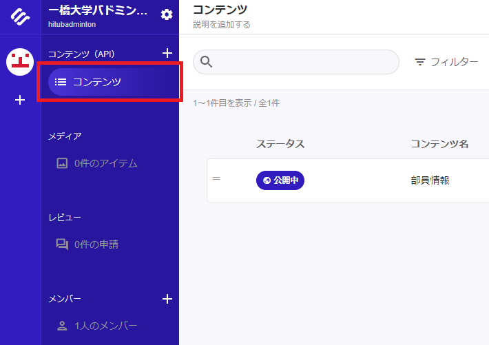
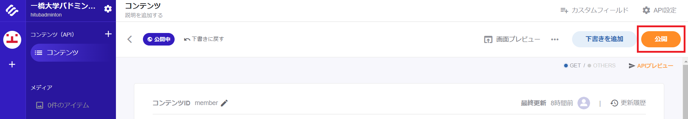
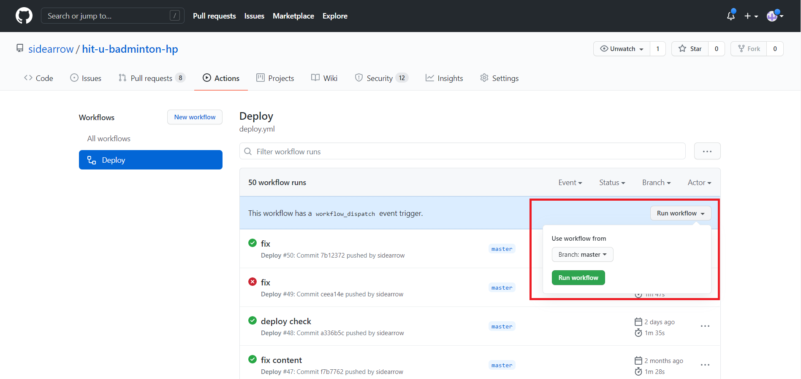

# MANUAL

## 更新の概要

部員情報のみ更新可能です。今後、更新可能なコンテンツを追加します

### 1. コンテンツチェックのページで編集する

- https://hit-u-badminton.web.app/admin/check-content/member
  - 認証はありませんが、こちらのページは確認用で、更新を実行できるわけではありません。
- 画面左側がエディタ、右側がプレビューとなっています。
- ページを更新すると、MicroCMS に保存されている内容に戻りますので、編集する際は別の場所で編集することをお勧めします。
  - メモ帳でも問題ありませんが、[Visual Studio Code](https://azure.microsoft.com/ja-jp/products/visual-studio-code/) がお勧めです。
  - ファイルとして保存する際は拡張子を `yaml` もしくは `yml` にすると良いです。

### 2. MicroCMS でコンテンツを保存する

- https://hitubadminton.microcms.io
- 左側のメニューから [コンテンツ] をクリックしてください。
- 編集したいコンテンツをクリックしてください。

- 1 の手順で編集した内容を「コンテンツ本文」に貼り付けて [公開] ボタンをクリックしてください。
  - この時点でホームページの更新はされませんのでお気軽に保存してください。
  - 再度 1 の手順のページを更新すると、保存した内容がデフォルトで反映されています。

### 3. ページの更新を実施する

- GitHub のページ更新用ワークフローのページを開いてください
  - https://github.com/sidearrow/hit-u-badminton-hp/actions/workflows/deploy.yml
- [Run workflow] ボタンをクリックしてください。ページの更新が開始されます。
- 緑のチェックマークが付きますと、更新完了です。

